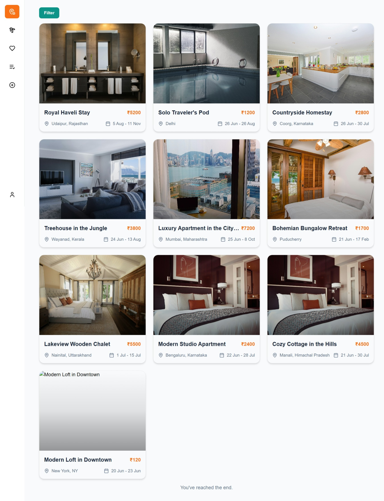
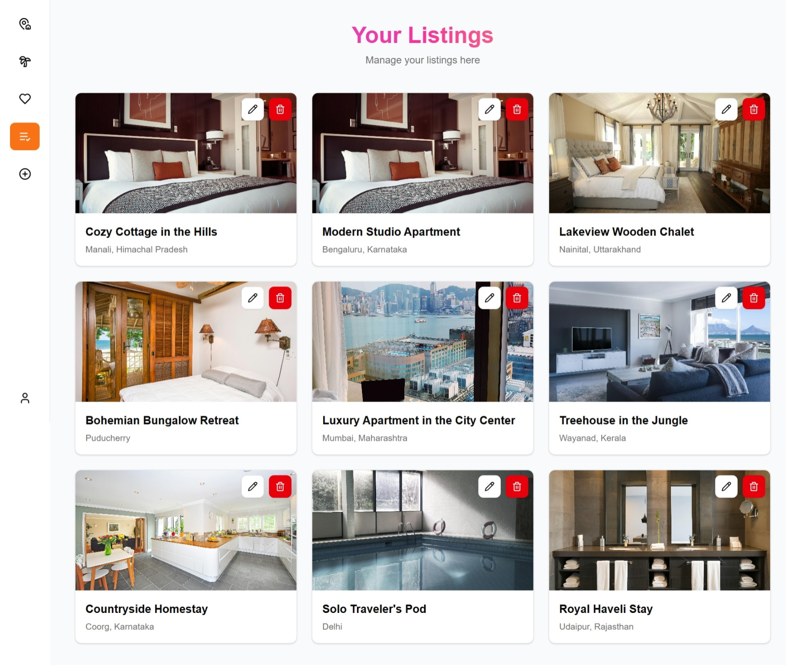

# 🏡 StayFinder – Full Stack Booking App

StayFinder is a modern, full-stack web application for browsing and booking curated stays around the world. It features a clean design, availability-based listings, user accounts, and more.

---

## 🌍 Screenshots

### Home


### Listings


### Wishlist


### Host 


### Booking


## 🧩 Tech Stack

### 🖥️ Frontend (Client)
- **React + TypeScript + Vite**
- **Tailwind CSS** with custom color tokens
- **shadcn/ui** components (button, input, toast, etc.)
- **Zustand** for state management
- **Axios** for API calls

### 🔧 Backend (Server)
- **Node.js + Express**
- **TypeScript**
- **MongoDB with Mongoose**
- **JWT Authentication**
- **Cloudinary** for image uploads (optional)


---


## 🎨 Custom Color Scheme

| Variable      | Hex        | Usage              |
|---------------|------------|--------------------|
| `--color-pri` | `#0d9488`  | Primary (CTA, Hero)|
| `--color-acc` | `#f97316`  | Accent (Buttons)   |
| `--color-txt` | `#1e293b`  | Main Text          |
| `--color-sec` | `#64748b`  | Sub Text           |
| `--color-bg`  | `#f8fafc`  | Background         |

Used as: `bg-pri`, `text-txt`, etc.

---

## 📁 Project Structure

### `/client`
```
- components/
- features/ (Zustand slices)
- pages/
- api/ (Axios clients)
- ui/ (custom UI wrappers)
- App.tsx, main.tsx
```

### `/server`
```
- controllers/
- routes/
- models/
- middlewares/
- utils/
- index.ts
```

---

## 🔐 Authentication

- JWT-based (Access & Refresh tokens)

---

## 📦 Listings API

- `GET /api/listings` - get all listings (with filters)
- `GET /api/listings/:id` - get a single listing
- `POST /api/listings` - create new listing (host only)
- `PUT /api/listings/:id` - update listing
- `DELETE /api/listings/:id` - delete listing

### Listing Model Includes:
- Title, Description, Location, Price
- Availability (array of start & end dates)
- Images, Host (User ID)

---

## 🌍 Frontend Pages

- Landing Page (Hero, Highlights, Destinations, Testimonials, Newsletter)
- Listings Page (with infinite scroll)
- Listing Detail Page (date picker, book now)
- Host Dashboard (edit listings, upload images)
- Auth Pages (login/register)
- Wishlist Page

---

## 🚀 Run Locally

### 1. Clone the Repo

```bash
git clone https://github.com/GuptaShubham-11/StayFinder.git
cd StayFinder
```

### 1.2 .Env File

```bash
Set up .env file from .env.sample
```

### 2. Setup Server

```bash
cd server
npm install
npm run dev
```

### 3. Setup Client

```bash
cd client
npm install
npm run dev
```

---

## 📸 Optional: Uploads

- Integrate Cloudinary for image storage.
- Use Multer for local testing.

---


## 📬 Contact

Made with ❤️ by Shubham Gupta  
Portfolio: [guptashubham.dev](https://gupta-shubham-11.vercel.app)  
GitHub: [@guptashubham11](https://github.com/GuptaShubham-11)